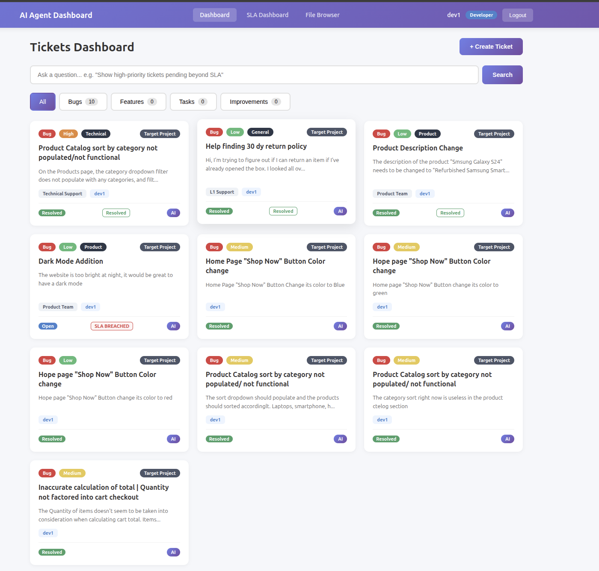
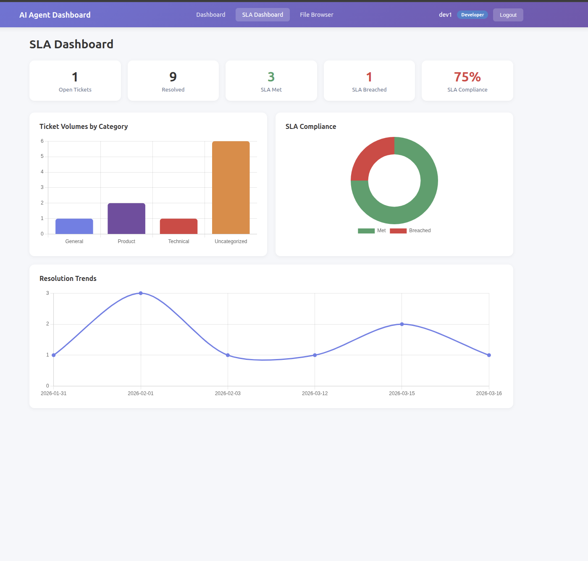
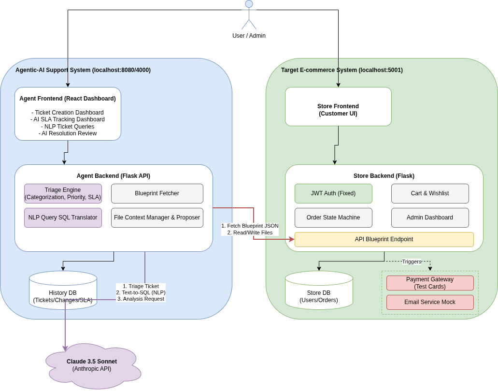

# Hacksplosion26 — Agentic AI for E-Commerce Bug Resolution

An AI-powered ticket management system that autonomously analyzes bugs, cross-references frontend code against backend API schemas, and proposes minimal targeted fixes for developer review. Built for the CyberCypher 2026 hackathon.

<table>
  <tr>
    <td></td>
    <td></td>
  </tr>
  <tr>
    <td align="center"><b>Tickets Dashboard</b> — AI-triaged bug tickets with priority, SLA, and resolution status</td>
    <td align="center"><b>SLA Dashboard</b> — Live compliance tracking, ticket volumes, and resolution trends</td>
  </tr>
</table>

## How It Works

```
Developer creates a ticket ("Category filter not working")
        │
        ▼
Auto-Triage — Claude classifies priority, SLA, resolver group
        │
        ▼
AI Resolution — reads target codebase + API blueprint schema
        │
        ▼
Cross-references frontend field usage against backend model schemas
        │
        ▼
Proposes minimal search/replace fixes (not full file rewrites)
        │
        ▼
Developer reviews inline diff → Accept / Reject / Rollback
```

## Project Structure

```
.
├── AgenticAi_Claude/        # AI Agent — ticket management + resolution engine
│   ├── backend/             # Flask API (port 8080)
│   ├── frontend/            # React UI (port 4000)
│   ├── ARCHITECTURE.md      # Detailed architecture docs
│   └── README.md            # Agent-specific setup
│
├── ecommerce-website/       # Target Project — e-commerce platform
│   ├── app/                 # Flask API (port 5001)
│   ├── frontend/            # React UI (port 3000)
│   └── README.md            # E-commerce-specific setup
│
├── run_all.sh               # Launches all 4 services
└── .gitignore
```

## Architecture

<p align="center">
  
</p>

The Agentic AI system (left) communicates with the target e-commerce project (right) by fetching the API blueprint schema and reading/writing source files. Claude analyzes the code, cross-references field names, and proposes minimal fixes.

## Quick Start

### Prerequisites
- Python 3.12+, Node.js 18+, MySQL/MariaDB
- Anthropic API key (Claude)

### 1. Environment Setup

```bash
# AgenticAi backend
echo "CLAUDE_API_KEY=your_key_here" > AgenticAi_Claude/.env

# Ecommerce backend
cp ecommerce-website/.env.example ecommerce-website/.env
# Edit with your MySQL credentials
```

### 2. Install Dependencies

```bash
# AgenticAi
cd AgenticAi_Claude && python3 -m venv venv && source venv/bin/activate && pip install -r requirements.txt
cd frontend && npm install && cd ../..

# Ecommerce
cd ecommerce-website && python3 -m venv venv && source venv/bin/activate && pip install -r requirements.txt
cd frontend && npm install && cd ../..
```

### 3. Database Setup

```bash
cd ecommerce-website
mysql -u root -p -e "CREATE DATABASE ecommerce_db;"
flask db upgrade
python seed_data.py  # Optional: sample data
cd ..
```

### 4. Run Everything

```bash
./run_all.sh
```

| Service | URL |
|---------|-----|
| E-Commerce Backend | http://localhost:5001 |
| E-Commerce Frontend | http://localhost:3000 |
| AI Agent Backend | http://localhost:8080 |
| AI Agent Frontend | http://localhost:4000 |

## Key Features

### Search/Replace Diff Engine
The AI returns targeted `<<<SEARCH ... >>>REPLACE ... <<<END` blocks instead of rewriting entire files. Only the specific broken lines are modified.

### Blueprint Cross-Reference
The e-commerce site exposes `GET /api/blueprint_json` with all model schemas and field names. The AI is forced to check every frontend field against this schema before diagnosing — catching mismatches like `product.category` vs `product.category_name`.

### Inline Diff Review
Proposed changes are shown as color-coded diffs (red/green) using the Myers algorithm. Developers see exactly what changes before accepting.

### Developer-Controlled Resolution
Accepting AI changes does not auto-resolve tickets. Developers explicitly mark tickets as resolved after verifying the fix works. Rollback is always available.

### Auto-Triage with SLA
New tickets are automatically classified by Claude: priority, resolver group, target category, and SLA deadline. Live countdown timers track breach risk.

## Tech Stack

| Component | Technology |
|-----------|-----------|
| AI Agent Backend | Python, Flask, Anthropic SDK (Claude) |
| AI Agent Frontend | React, CSS |
| E-Commerce Backend | Python, Flask, SQLAlchemy, MySQL |
| E-Commerce Frontend | React, Material-UI |
| Diff Engine | `diff` npm package (Myers algorithm) |
| Database (Agent) | SQLite |
| Database (E-Commerce) | MySQL/MariaDB |

## Documentation

- [`AgenticAi_Claude/ARCHITECTURE.md`](AgenticAi_Claude/ARCHITECTURE.md) — Resolution pipeline, search/replace format, blueprint cross-reference
- [`AgenticAi_Claude/README.md`](AgenticAi_Claude/README.md) — Agent setup and API reference
- [`ecommerce-website/README.md`](ecommerce-website/README.md) — E-commerce setup and API endpoints

## Team

Built for CyberCypher 2026 hackathon.
